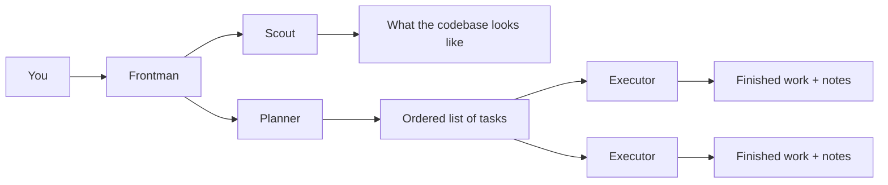

# Crewmate

**Think it through first. Then let the agents build it.**

Crewmate sits between you and your coding agents. You explain what you want built. Crewmate turns that into a clear brief, looks through your codebase for the relevant patterns, splits the work into ordered tasks, then hands those tasks to agents that can run several at once without stepping on each other.

`crewmate` is the command-line tool that makes this work. It keeps track of briefs, tasks, file locks, and notes from past work, so the agent guiding your project can spend its time making calls, not doing bookkeeping.

## The problem it solves

A coding agent is good at building things. Point it at a big, vague request, though, and it will start writing code before anyone has agreed on what "done" means.

Before real work can start, something has to pin down what's actually being asked for, look through the existing code for the patterns already in use, break the work into steps that don't collide with each other, and stop two agents from editing the same file at once. Once work is done, whatever got learned along the way needs to stick around for later — not vanish when the conversation ends.

Crewmate takes care of that planning and bookkeeping layer. Frontman, the agent you talk to, stays focused on decisions and coordination and never touches your files directly. Reading the codebase, planning the work, and writing the code happen in separate agents built for exactly those jobs.

## Setting up

You'll need Node.js 20 or newer.

Install the CLI:

```bash
git clone https://github.com/errevion/crewmate
cd crewmate
npm install
npm run build
npm link
```

`npm link` puts `crewmate` on your PATH so you can run it from any project.

Then, inside the project you want to work on:

```bash
cd ~/my-project
crewmate init --harness opencode
```

This adds a few files under `.opencode/`:

- `plugins/crewmate.ts` — hooks Crewmate's tools into OpenCode
- `commands/brief.md` — the `/brief` command that starts the planning conversation
- `commands/execute.md` — the `/execute` command that runs the plan
- `agents/frontman.md` — the supervisor's prompt
- `agents/scout.md` — the read-only codebase explorer's prompt
- `agents/planner.md` — the task-breakdown agent's prompt
- `agents/executor.md` — the implementer's prompt

Crewmate keeps its own state in `.crewmate/crewmate.db` (SQLite). Add `.crewmate/` to your `.gitignore`. It doesn't need to be checked in.

## Running a project through it

The typical workflow uses two commands inside OpenCode: `/brief` to plan and structure the work, and `/execute` to build it safely. You can also drive the CLI yourself if you prefer scripting.



### Agent workflow (`/brief` and `/execute`)

#### 1. Plan with `/brief`

Start by running `/brief` (optionally passing your initial goal, e.g. `/brief Add GitHub OAuth authentication`):

1. **Requirements gathering** — Frontman creates a new brief and asks questions conversationally (one or two at a time) to fill the five required fields (`workType`, `goal`, `scope`, `functionalRequirements`, and `acceptanceCriteria`).
2. **Codebase discovery (Scout)** — Frontman dispatches Scout to inspect your codebase, project structure, existing configs, and dependencies. Scout reports objective workspace facts, which Frontman discusses with you before filling optional brief fields (`technicalStack`, `constraints`, etc.).
3. **Task breakdown (Planner)** — Once the brief is finalized, Frontman automatically dispatches Planner to decompose the brief into a dependency-ordered list of concrete implementation tasks.
4. **Review & persistence** — Frontman presents the proposed task table for your review. Once approved, tasks are saved to SQLite (`crewmate_add_task`). Frontman then prompts you to run `/execute` when ready.

#### 2. Build with `/execute`

When you are ready to begin implementation, run `/execute`:

1. **Dependency resolution** — Frontman inspects the brief's tasks and active file locks, identifying all `pending` tasks whose dependencies are already `completed`.
2. **Parallel dispatch (Executor)** — Frontman dispatches Executor subagents in parallel for independent tasks that touch different files.
3. **Locking & implementation** — Each Executor acquires locks on the files it needs (`crewmate_acquire_lock`), implements the changes, writes tests, logs incremental artifacts (`crewmate_add_artifact` for facts, decisions, and API contracts), updates task status to `completed`, and releases its locks.
4. **Continuous execution** — Frontman continuously unblocks and dispatches downstream tasks across batches without prompting, pausing only if an Executor hits an error or test failure so you can decide how to proceed.
5. **Final summary** — When all tasks finish, Frontman presents a summary of completed work, recorded architectural decisions, and verification instructions.

### CLI workflow (manual)

If you prefer driving the CLI directly:

```bash
crewmate brief init
crewmate brief set workType software
crewmate brief set goal "Add GitHub OAuth authentication"
crewmate brief set scope '{"included":["authentication","oauth flow"],"excluded":["admin panel"]}'
crewmate brief set functionalRequirements '["GitHub OAuth 2.0 login","Token storage","User profile sync"]'
crewmate brief set acceptanceCriteria '["Users can log in via GitHub","Tokens persist securely"]'
crewmate brief complete
```

## The brief

The brief is the one source of truth Frontman and every downstream agent work from. Five fields are required before Crewmate will let you mark it complete:

| Field | Type | Example |
| --- | --- | --- |
| `workType` | enum | `"software"`, `"infrastructure"`, `"data"`, `"documentation"`, `"audit"` |
| `goal` | string | `"Build real-time chat feature"` |
| `scope` | JSON | `{included: ["messaging"], excluded: ["voice"]}` |
| `functionalRequirements` | JSON array | `["user-messages", "read-receipts"]` |
| `acceptanceCriteria` | JSON array | `["Messages persist", "Files < 25MB"]` |

You can also set `technicalStack`, `constraints`, `existingCodebase`, `referenceMaterials`, `qualityStandards`, `dependencies`, `risks`, and `deliverables`.T hese add context but aren't required.

## Who does what

Each agent gets only the context it needs for its own job, not the full history of the conversation.

| Agent | Job | What it can touch |
| --- | --- | --- |
| **Frontman** | Runs the show. Delegates work, keeps state up to date | Nothing directly. It never reads or edits code itself. |
| **Scout** | Looks through the codebase and reports back what's actually there | Read-only. Reports facts, doesn't make calls. |
| **Planner** | Turns a completed brief into an ordered list of concrete tasks | The brief and Scout's findings. |
| **Executor** | Does the actual implementation work | Its assigned task, under a file lock. |

## Keeping parallel agents out of each other's way

When more than one Executor is running at the same time, file locks stop them from touching the same files:

```bash
crewmate lock acquire <taskId> --files src/auth/github.ts src/auth/session.ts
crewmate lock list
crewmate lock release <taskId>
```

If a task can't get a lock because another task already holds it, the Executor stops right away instead of guessing and risking a broken merge.

## Carrying knowledge forward

Executors write down what they find as they go, so later tasks don't have to rediscover it:

| Type | What it holds |
| --- | --- |
| `fact` | Something true about the system right now |
| `decision` | A design or architecture choice that was made |
| `api_contract` | A route signature, interface, or schema |
| `constraint` | A rule later tasks need to respect |
| `note` | A general observation |
| `log` | A record of what happened during execution |

These stick around independent of any conversation, so a task started next week can build on what a task from today already figured out.

## Deciding what runs next

Tasks form a dependency graph rather than a flat list, a DAG, in the usual sense: each task can name other tasks it depends on, and nothing runs before its dependencies finish. Frontman looks for every task that's `pending` with all its dependencies `completed`, then dispatches as many of those in parallel as the file locks will allow.

## Where things live

Everything is stored in SQLite, at `.crewmate/crewmate.db`:

- **briefs** — project definitions, with every field saved as JSON
- **tasks** — linked to a brief, with dependency edges between them
- **artifacts** — the knowledge Executors have written down
- **locks** — which files are currently claimed, and by which task

This survives between sessions. Point Crewmate at a project that already has a `.crewmate` folder and it picks up right where it left off.

## Connecting to a coding harness

Crewmate talks to AI coding harnesses through an adapter, so the core logic doesn't need to know which harness it's running under. OpenCode is supported today; Claude Code, Codex, and Cursor are reasonable candidates for future adapters. See [src/harness/README.md](src/harness/README.md) for adapter architecture details and instructions on adding new harness adapters.

## Commands

Every command prints structured JSON to stdout, so it's easy to script against or feed back to an agent.

| Command | What it does |
| --- | --- |
| `crewmate init` | Set up the integration files for a harness |
| `crewmate brief init` | Start a new draft brief |
| `crewmate brief set <field> <value>` | Set one field on the brief |
| `crewmate brief get <field>` | Read one field back |
| `crewmate brief show` | Show the whole brief |
| `crewmate brief status` | Check which required fields are still missing |
| `crewmate brief complete` | Mark the brief as done |
| `crewmate task add <briefId>` | Add a task (`--title`, `--description`, `--dependencies`, `--field`) |
| `crewmate task list --brief <id>` | List every task under a brief |
| `crewmate task update <id> --status <s>` | Change a task's status (`pending`, `in_progress`, `completed`) |
| `crewmate task remove <id>` | Delete a task |
| `crewmate lock acquire <taskId>` | Claim files for a task (`--files`) |
| `crewmate lock release <taskId>` | Release a task's locks |
| `crewmate lock list` | Show every active lock |
| `crewmate artifact add <taskId>` | Record an artifact (`--type`, `--content`) |
| `crewmate artifact list` | List artifacts, filterable by `--brief`, `--task`, `--type` |

Run `crewmate --help` for the full, current list.

A typical session, watching a brief through to completion:

```bash
BRIEF_ID=$(crewmate brief init | jq -r '.id')
crewmate brief set workType software
crewmate brief set goal "Add GitHub OAuth login"
crewmate brief set scope '{"included":["auth"],"excluded":["admin"]}'
crewmate brief set functionalRequirements '["GitHub OAuth 2.0","Token storage"]'
crewmate brief set acceptanceCriteria '["Users can log in","Tokens persist"]'
crewmate brief complete

# while it's running
crewmate task list --brief $BRIEF_ID
crewmate lock list
crewmate artifact list --brief $BRIEF_ID

# if something's stuck
crewmate brief status      # see which required fields are missing
crewmate task remove <id>  # remove a task that's stuck
```

## Requirements

- Node.js 20 or newer
- A project directory, new or existing
- OpenCode installed (the only supported harness for now)

## Working on Crewmate itself

```bash
git clone https://github.com/errevion/crewmate
cd crewmate
npm install
npm run build          # build with tsup
npm run dev            # build in watch mode
npm test               # unit tests
npm run test:e2e       # build, then run end-to-end tests
npm run test:coverage  # unit test coverage (v8)
npm run typecheck      # type-check without emitting
npm run lint           # lint and auto-fix
npm run format         # format with Prettier
```

## Project layout

```text
src/
  commands/       CLI command handlers (init, brief, task, lock, artifact)
  db/             SQLite layer — connection, migrations, repositories
  harness/        Harness adapters (OpenCode today)
    adapters/opencode/
      templates/  Agent prompts and plugin templates
  models/         Data models, constants, field definitions
  utils/          Validation and error handling
tests/
  e2e/            End-to-end CLI tests
  validation.spec.ts
  harness.spec.ts
  lock.spec.ts
  artifact.spec.ts
```

## License

Private
