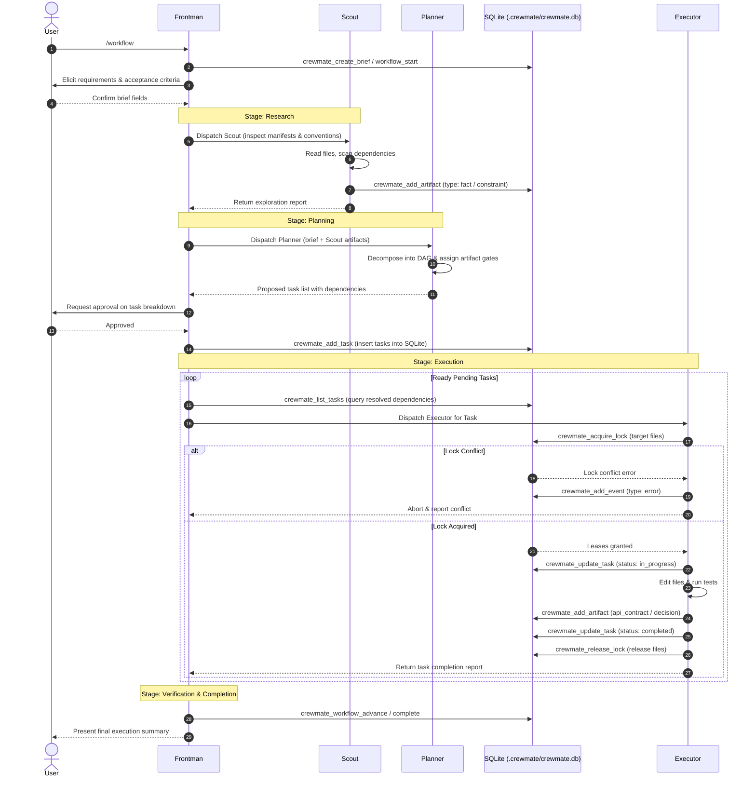

# Architecture & Agents

Crewmate coordinates multi-agent software engineering using an orchestrator-subagent hierarchy. By decomposing development into specialized, constrained agent roles and governing them with a persistent local database, Crewmate eliminates coordination deadlocks, write conflicts, and context fragmentation.

---

## Multi-Agent Model Overview

Monolithic autonomous coding agents often attempt to simultaneously interview the user, inspect codebases, draft architectures, edit files, and run tests. This causes severe failure modes: tool overloading, unintended file modifications, and inability to resume interrupted workflows.

Crewmate enforces **Separation of Concerns** across four dedicated roles:

```
                  ┌─────────────────────────────────┐
                  │       Frontman (Primary)        │
                  │  Orchestrator & State Tracker   │
                  │  Zero Direct I/O · User Gateway │
                  └───────┬──────────────┬──────────┘
                          │              │
             ┌────────────┘              └────────────┐
             ▼                                        ▼
    ┌─────────────────┐                      ┌─────────────────┐
    │  Scout (Sub)    │                      │  Planner (Sub)  │
    │  Read-Only      │                      │  DAG Decomposer │
    │  Exploration    │                      │  Compliance     │
    └─────────────────┘                      └────────┬────────┘
                                                      │
                                                      ▼
                                             ┌─────────────────┐
                                             │ Executor (Sub)  │
                                             │ Implementation  │
                                             │ Locked Leases   │
                                             └─────────────────┘
```

---

## The Four Core Roles

### 1. Frontman (Supervisor Orchestrator)
- **Role**: Primary session manager, requirements interviewer, and workflow driver.
- **Zero Direct I/O**: Frontman has no permission to read or write project code, run bash commands, or search files directly (`read: deny`, `edit: deny`, `bash: deny`, `glob: deny`, `grep: deny`).
- **User Gateway**: Conducts interactive requirement interviews and presents architectural choices using harness approval tools (`question`).
- **State & Activity Tracking**: Persists lifecycle milestones and updates live activity state (`crewmate_set_activity`) to feed the `crewmate watch` dashboard.
- **Delegation**: Dispatches subagents for exploration, planning, and task execution according to the current stage of the active workflow graph.

### 2. Scout (Read-Only Codebase Explorer)
- **Role**: Discovers workspace architecture, manifests, configuration files, and coding conventions.
- **Permissions**: Read-only tools enabled (`read: allow`, `glob: allow`, `grep: allow`, `webfetch: allow`). Write access and system command execution are denied (`edit: deny`, `bash: deny`).
- **Objective Reporting**: Reports concrete codebase facts (e.g. runtimes, dependencies, file structures) back to Frontman without recommending or enforcing subjective opinions.
- **Artifact Discovery**: Records brief-level `fact` and `constraint` knowledge artifacts (`crewmate_add_artifact`) into SQLite for downstream planning.

### 3. Planner (Task Decomposer & DAG Architect)
- **Role**: Analyzes the finalized brief alongside Scout discoveries to produce an actionable Directed Acyclic Graph (DAG) of implementation tasks.
- **Task Decomposition**: Breaks down features into independent execution units with clear titles, descriptions, and dependency edges.
- **Conflict Prevention**: Identifies shared module modifications and adds explicit dependencies between tasks to sequence writes.
- **Artifact Compliance Assignment**: Dictates mandatory knowledge outputs for each task (e.g. requiring `api_contract` for routes or `decision` for architectural choices) before tasks can be marked complete.

### 4. Executor (Autonomous Implementation Specialist)
- **Role**: Implements assigned tasks within an isolated session context.
- **File Lease Protocol**: Before editing, an Executor must acquire leases on target files using `crewmate_acquire_lock`. If any target file is already leased by a concurrent task, the Executor immediately aborts to avoid collisions.
- **Verification**: Runs builds, linters, and unit test suites via shell execution (`bash`).
- **Knowledge Sharing**: Records newly established interfaces (`api_contract`), decisions (`decision`), or discovered gotchas (`constraint`) using `crewmate_add_artifact`.
- **Gated Completion**: Task status cannot transition to `completed` without satisfying the task's required artifact types. File locks are released once completion is confirmed.

---

## Agent Interaction Flow

The following sequence demonstrates how Frontman orchestrates Scout, Planner, and parallel Executors through SQLite state persistence:



---

## Persistent Local Storage (`.crewmate/crewmate.db`)

Crewmate stores all operational state locally inside `.crewmate/crewmate.db` using `better-sqlite3`.

### SQLite WAL Mode Configuration
To maximize performance and accommodate concurrent CLI read/write operations from parallel agents, Crewmate initializes database connections with optimized pragmas:

```typescript
// src/db/connection.ts
db.pragma('journal_mode = WAL');     // Write-Ahead Logging for high concurrency
db.pragma('foreign_keys = ON');       // Strict referential integrity
db.pragma('busy_timeout = 5000');     // 5s busy wait retry before locking errors
```

- **Write-Ahead Logging (WAL)**: Allows multiple concurrent reader processes to read the database simultaneously while a writer process commits transactions without blocking.
- **Busy Timeout (`5000ms`)**: Ensures transient write contentions between fast CLI tool invocations wait and retry automatically instead of crashing with `SQLITE_BUSY`.
- **Foreign Key Enforcement**: Cascades deletes and maintains integrity across briefs, tasks, artifacts, and locks.

### Core Relational Schema

| Table | Primary Responsibility | Key Foreign Keys |
| :--- | :--- | :--- |
| `briefs` | Stores top-level project specifications, goals, and status (`draft`, `complete`). | None |
| `brief_fields` | Dynamic key-value pairs (`workType`, `scope`, `acceptanceCriteria`). | `REFERENCES briefs(id)` |
| `tasks` | DAG task definitions, statuses, and dependency JSON arrays. | `REFERENCES briefs(id)` |
| `file_locks` | Active file path leases assigned to running tasks. | `REFERENCES tasks(id)` |
| `execution_artifacts` | Knowledge base entries (`fact`, `decision`, `api_contract`, `constraint`). | `REFERENCES tasks(id)`, `briefs(id)` |
| `execution_events` | Granular workflow lifecycle audit events for the watch dashboard. | `REFERENCES briefs(id)`, `tasks(id)` |
| `workflow_runs` | Active workflow execution state, current stage, and runtime context. | `REFERENCES briefs(id)` |
| `frontman_activities` | Real-time state machine history for Frontman observability. | `REFERENCES briefs(id)` |

---

## Concurrency Safety Overview

Parallel agent execution introduces file race conditions where multiple subagents attempt simultaneous edits on identical files. Crewmate handles concurrency safety through a multi-layered strategy:

### 1. Atomic Multi-Path Locking
File locks are managed in `.crewmate/crewmate.db` via `better-sqlite3` atomic transactions. When an Executor requests leases for a batch of files:
- Paths are normalized across operating systems (converting relative paths, path separators, and case-folding on Windows/macOS).
- The lock acquisition transaction checks all requested files simultaneously against `file_locks`.
- If **any** requested file is held by another active task, the entire transaction is rolled back and an atomic conflict error is returned:
  ```json
  {
    "ok": false,
    "conflict": "src/services/auth.ts",
    "lockedBy": "task_a1b2"
  }
  ```
- No partial locks are left behind.

### 2. Time-Based Lease Expiration
To prevent permanent deadlocks caused by crashed processes or aborted sessions:
- All lock inserts automatically configure an expiration window: `expires_at = datetime('now', '+5 minutes')`.
- Lock renewal occurs automatically if the holding task re-requests or refreshes the lease.
- Every lock acquisition automatically purges expired leases (`DELETE FROM file_locks WHERE expires_at < datetime('now')`), ensuring stale locks left by orphaned agent sessions never block execution.

### 3. DAG Dependency Sequencing
Before file locks even come into play, **Planner** reduces concurrency conflicts at the architecture level. By assigning explicit dependency edges between tasks that share common files or interfaces, tasks are sequenced into linear DAG stages rather than dispatched simultaneously.
