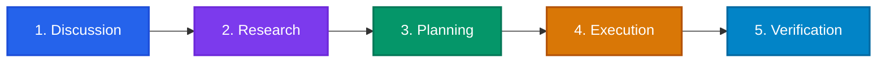

# Workflow Engine & DAG

Crewmate's workflow engine orchestrates complex multi-agent software development lifecycles using hierarchical Directed Acyclic Graphs (DAGs). Rather than treating agent collaboration as unstructured chat, Crewmate models work as deterministic pipelines of discrete **Stages**, inside which individual **Nodes** execute specific agent routines or automated tasks connected by condition-evaluated **Edges**.

---

## Architecture & Hierarchy

Crewmate organizes workflows hierarchically:

```
WorkflowDefinition
 └── StageDefinition[] (Sequential pipeline: Discussion -> Research -> ...)
      └── GraphDefinition (Internal execution graph for the stage)
           ├── NodeDefinition[] (Executable units: agent, task, tool, etc.)
           └── EdgeDefinition[] (Transitions & conditional routing)
```

### Core Hierarchy Concepts

| Level | Type | Responsibility |
| :--- | :--- | :--- |
| **Workflow** | `WorkflowDefinition` | The root pipeline. Manages global execution state, ordered stages, and global context variables. |
| **Stage** | `StageDefinition` | A self-contained milestone (e.g., Planning or Execution). Contains its own input/output contracts, entry/exit conditions, and an execution graph. |
| **Graph** | `GraphDefinition` | The DAG executed within a stage, defining nodes, edges, iteration limits, and entry/exit node IDs. |
| **Node** | `NodeDefinition` | An atomic step executed by an agent runner, task runner, tool invocation, human gate, or conditional router. |
| **Edge** | `EdgeDefinition` | A directional connection (`from -> to`) governing execution order and conditional branching. |

---

## Default 5-Stage Software Development Workflow

Every Crewmate project includes the default software development workflow (`software-development`). It enforces a rigorous 5-stage engineering lifecycle designed for autonomous multi-agent development:



### Stage Details

1. **Discussion (`discussion`)**:
   - **Agents / Nodes**: `frontman-interview` &rarr; `validate-brief`.
   - **Goal**: Frontman interviews the user to elicit scope, work type, goals, functional requirements, and acceptance criteria. Populates the active Brief.
2. **Research (`research`)**:
   - **Agents / Nodes**: `scout-explore`.
   - **Goal**: Scout autonomously analyzes the codebase, cataloging architecture, dependencies, directory structures, and code patterns into knowledge artifacts.
3. **Planning (`planning`)**:
   - **Agents / Nodes**: `planner-decompose`.
   - **Goal**: Planner digests the Brief and Scout's research to decompose implementation into discrete tasks, establishing dependency DAGs and artifact compliance requirements.
4. **Execution (`execution`)**:
   - **Agents / Nodes**: `executor-run`.
   - **Goal**: Executors claim tasks, acquire granular file locks, modify code, run test suites, and record mandatory knowledge artifacts before marking tasks complete.
5. **Verification (`verification`)**:
   - **Agents / Nodes**: `verify-artifacts`.
   - **Goal**: Evaluates all produced code, checks test results, reviews artifact compliance, and confirms that all acceptance criteria are met before completion.

---

## Lifecycle Operations

Workflows can be managed dynamically via the CLI or automated by agent harnesses. State is persisted in SQLite (`.crewmate/crewmate.db`).

| Operation | Command | Purpose |
| :--- | :--- | :--- |
| `start` | `crewmate workflow start` | Initializes a new workflow run bound to the active or specified brief. |
| `status` | `crewmate workflow status` | Inspects the current stage, active nodes, context, and stage status. |
| `advance` | `crewmate workflow advance` | Moves the workflow forward to the next stage, merging outputs into context. |
| `skip` | `crewmate workflow skip <stage>` | Skips a specific stage (marks it as `skipped`) and proceeds. |
| `set-stage` | `crewmate workflow set-stage <stage>` | Jumps directly to any valid stage ID, updating stage status. |
| `pause` | `crewmate workflow pause` | Pauses the running workflow. |
| `resume` | `crewmate workflow resume` | Resumes a previously paused workflow. |
| `cancel` | `crewmate workflow cancel` | Cancels the active workflow run. |
| `run` | `crewmate workflow run` | Headlessly executes a workflow or graph definition using in-memory runners. |

### CLI Examples

```bash
# Start default workflow on the active brief
crewmate workflow start

# Start with an agent summary view
crewmate workflow start --agent-summary

# Start a custom workflow file with initial context
crewmate workflow start -f .crewmate/workflows/default.json -c '{"environment":"staging"}'

# Check current workflow status
crewmate workflow status --agent-summary

# Advance current stage and supply stage output data
crewmate workflow advance -o '{"discussionApproved": true}'

# Skip the research stage if codebase is already known
crewmate workflow skip research

# Jump directly to execution
crewmate workflow set-stage execution

# Pause and resume
crewmate workflow pause
crewmate workflow resume

# Headless headless execution (ideal for CI/CD)
crewmate workflow run -f .crewmate/workflows/default.json --brief c6078a9f
```

---

## Modular Workflow Files

Rather than forcing monolithic configuration files, Crewmate supports modular workflow decomposition. Large workflows are broken into reusable stages and atomic nodes stored in `.crewmate/workflows/`:

```
.crewmate/workflows/
├── default.json                    # Root WorkflowDefinition referencing stages
├── stages/
│   ├── discussion.json             # StageDefinition referencing node files
│   ├── research.json
│   ├── planning.json
│   ├── execution.json
│   └── verification.json
└── nodes/
    ├── frontman-interview.json     # NodeDefinition (AgentNodeConfig)
    ├── validate-brief.json
    ├── scout-explore.json
    ├── planner-decompose.json
    ├── executor-run.json
    └── verify-artifacts.json
```

### Path Dereferencing via Resolver

Crewmate's workflow resolver (`loadAndResolveWorkflow`) recursively dereferences relative string paths relative to the calling file:

1. In `default.json`, each entry in `stages` can be a file path string (e.g. `"./stages/discussion.json"`) or an inline stage object.
2. In `discussion.json`, each entry in `graph.nodes` can be a file path string (e.g. `"../nodes/frontman-interview.json"`) or an inline node object.
3. The resolver resolves paths relative to the directory of the file containing the reference. If `default.json` references `./stages/discussion.json`, the stage is loaded from `.crewmate/workflows/stages/discussion.json`. When `discussion.json` references `../nodes/frontman-interview.json`, the path resolves relative to `.crewmate/workflows/stages/` into `.crewmate/workflows/nodes/frontman-interview.json`.

This allows development teams to share common nodes across multiple specialized workflows.

---

## Context Flow & Data Passing

Crewmate maintains execution context across the workflow lifecycle. Nodes consume inputs and publish outputs that propagate downstream.

### Variable References & Resolution

1. **`$variable` Syntax**:
   In node input definitions, string values prefixed with `$` are dynamically looked up from context:
   ```json
   {
     "inputs": {
       "targetBrief": "$briefId",
       "deployEnv": "$environment"
     }
   }
   ```
   The engine searches for `$variable` across:
   1. `graphContext` (current stage graph variables)
   2. `stageContext` (stage-scoped variables)
   3. `globalContext` (workflow-level variables)

2. **Dotted Paths**:
   Edges and conditions inspect structured state using dot-notation:
   - `node.<nodeId>.<outputKey>`: Accesses outputs from a specific node in the stage (e.g. `node.validate-brief.isValid`).
   - `output.<key>`: Accesses outputs from the immediate predecessor node.
   - `global.<key>`: Accesses workflow-level global context.
   - `stage.<key>`: Accesses current stage context.
   - `graph.<key>`: Accesses stage graph context.

3. **Port Mappings**:
   Nodes also support explicit port bindings:
   ```json
   {
     "inputs": [
       {
         "sourceNodeId": "frontman-interview",
         "fromPort": "briefCompleted",
         "toPort": "readyForValidation"
       }
     ]
   }
   ```

---

## Edge Routing & Conditions

Edges define the transition between nodes. Every edge can specify a `condition` object evaluated by the runtime engine before routing:

```typescript
interface EdgeDefinition {
  id?: string;
  from: string;
  to: string;
  condition?: EdgeCondition;
  label?: string;
}
```

### Condition Types

1. **`always`** (Default):
   The edge is traversed unconditionally as soon as the source node finishes.
   ```json
   {
     "type": "always"
   }
   ```

2. **`on_success`**:
   The edge is only traversed if the source node finishes with status `completed`.
   ```json
   {
     "type": "on_success"
   }
   ```

3. **`on_failure`**:
   The edge is only traversed if the source node fails (status `failed`), enabling error-handling or retry branches.
   ```json
   {
     "type": "on_failure"
   }
   ```

4. **`expression` / `predicate`**:
   Evaluates boolean expressions or field comparisons against runtime context:
   
   **Comparison Operator Style**:
   ```json
   {
     "type": "expression",
     "field": "node.validate-brief.isValid",
     "operator": "equals",
     "value": true
   }
   ```
   Supported operators: `equals`, `not_equals`, `contains`, `greater_than`, `less_than`, `exists`, `truthy`, `falsy`.

   **Safe String Expression Style**:
   ```json
   {
     "type": "expression",
     "expression": "node.review-gate.score >= 80"
   }
   ```

---

## Custom Workflow Example

Below is a complete, practical example of a custom 2-stage workflow JSON definition (`.crewmate/workflows/fast-track.json`) demonstrating stages, nodes, edges, context passing, and conditions:

```json
{
  "id": "fast-track-fix",
  "name": "Fast-Track Bug Fix Workflow",
  "description": "Streamlined 2-stage workflow for emergency hotfixes and urgent bug resolutions.",
  "version": "1.0.0",
  "initialContext": {
    "severity": "high",
    "requireReview": true
  },
  "stages": [
    {
      "id": "triage",
      "name": "Triage & Diagnostics",
      "description": "Inspect bug reproduction and determine target files.",
      "graph": {
        "id": "triage-graph",
        "nodes": [
          {
            "id": "diagnose-issue",
            "name": "Diagnose Bug",
            "type": "agent",
            "config": {
              "agent": "scout",
              "prompt": "Identify the failing stack trace and locate responsible source files."
            }
          },
          {
            "id": "assess-scope",
            "name": "Assess Fix Scope",
            "type": "agent",
            "inputs": {
              "diagnostics": "$node.diagnose-issue.outputs"
            },
            "config": {
              "agent": "planner",
              "prompt": "Create targeted fix tasks with file locks."
            }
          }
        ],
        "edges": [
          {
            "from": "diagnose-issue",
            "to": "assess-scope",
            "condition": {
              "type": "on_success"
            }
          }
        ]
      }
    },
    {
      "id": "remediation",
      "name": "Remediation & Testing",
      "description": "Apply patch and run test suite.",
      "graph": {
        "id": "remediation-graph",
        "nodes": [
          {
            "id": "apply-patch",
            "name": "Apply Patch",
            "type": "agent",
            "config": {
              "agent": "executor",
              "prompt": "Implement fix and acquire file locks."
            }
          },
          {
            "id": "run-tests",
            "name": "Run Verification Tests",
            "type": "tool",
            "config": {
              "command": "npm test"
            }
          }
        ],
        "edges": [
          {
            "from": "apply-patch",
            "to": "run-tests",
            "condition": {
              "type": "on_success"
            }
          },
          {
            "from": "run-tests",
            "to": "apply-patch",
            "condition": {
              "type": "on_failure"
            },
            "label": "Retry patch on test failure"
          }
        ]
      }
    }
  ]
}
```

Validate and start your custom workflow:

```bash
# Validate workflow structure
crewmate workflow validate .crewmate/workflows/fast-track.json

# Start the workflow
crewmate workflow start -f .crewmate/workflows/fast-track.json --agent-summary
```
